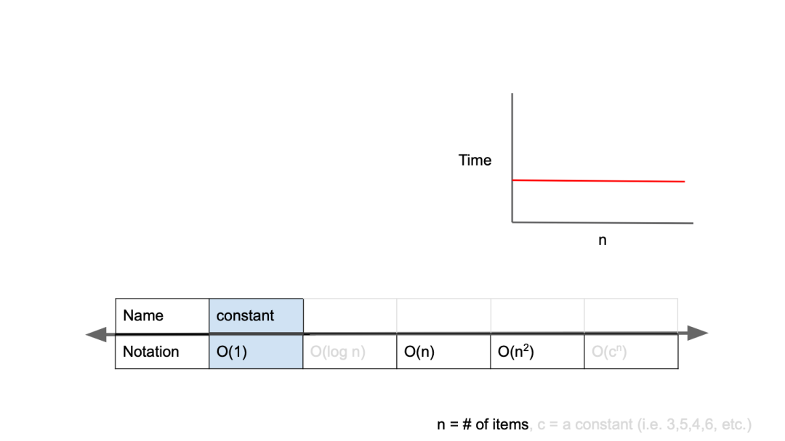
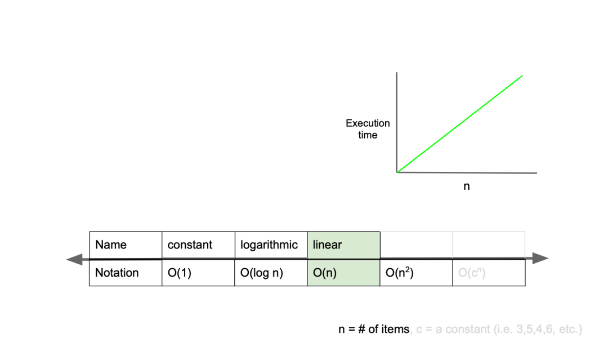
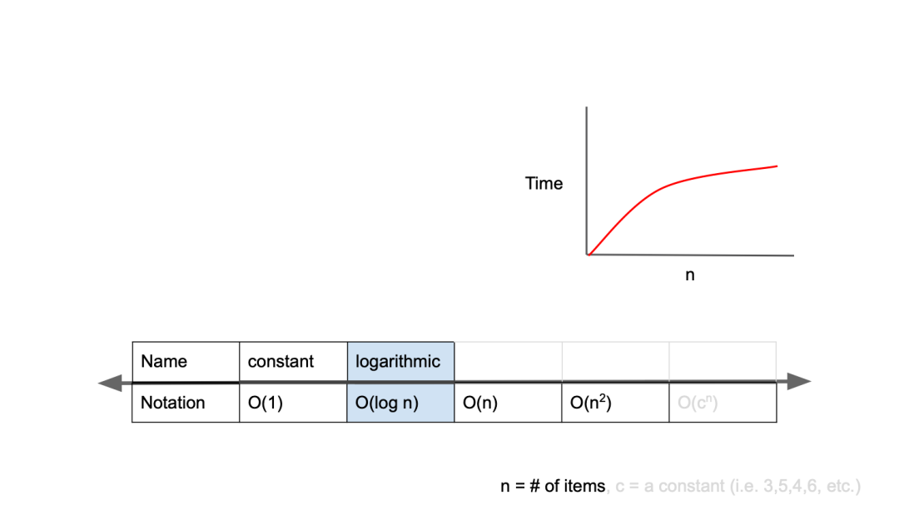
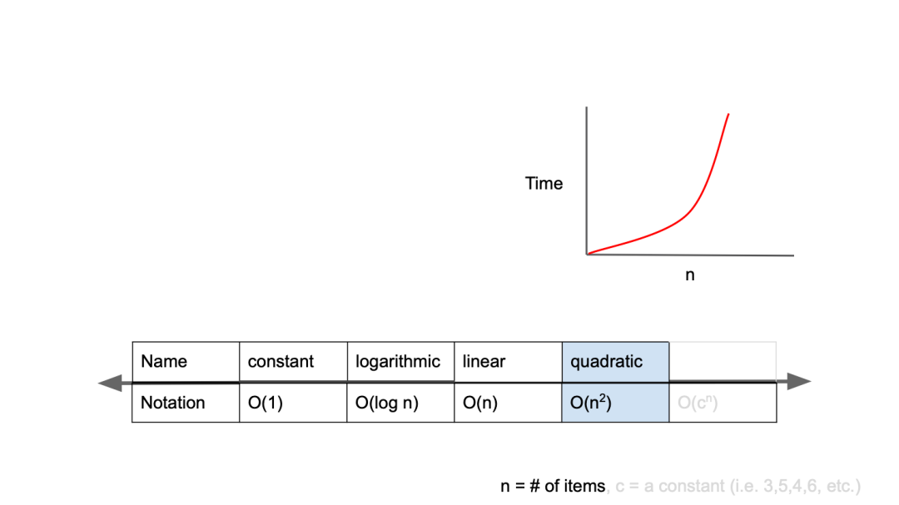
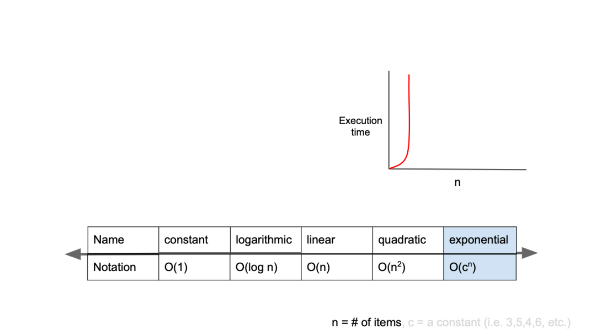
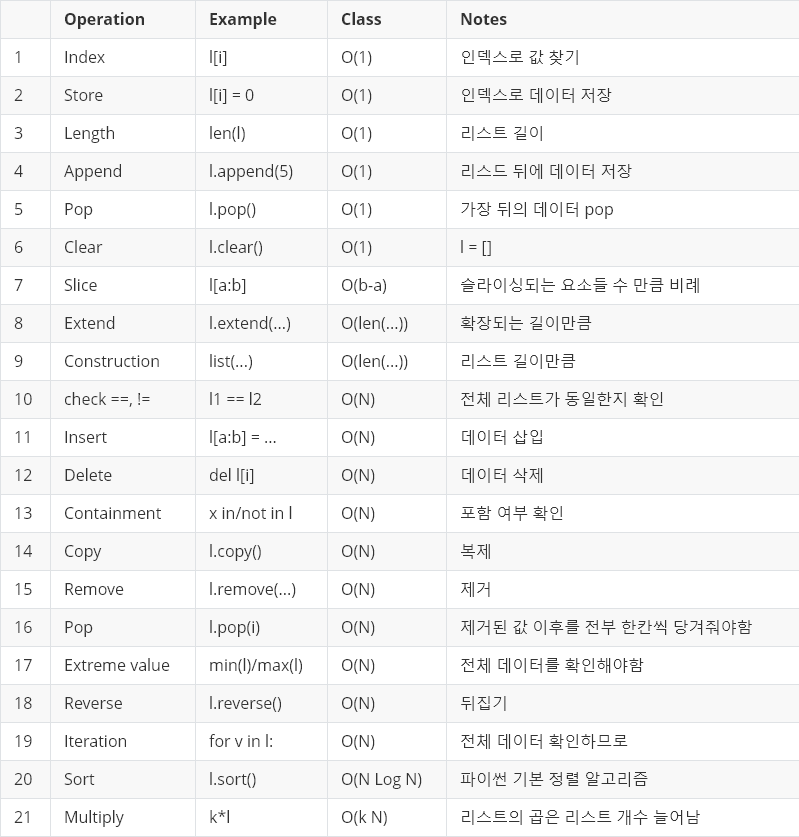
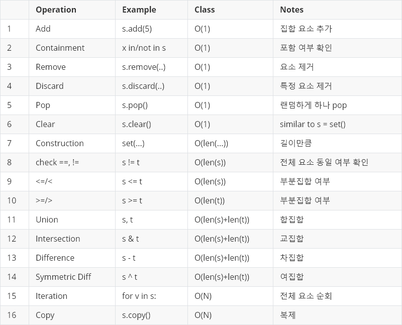
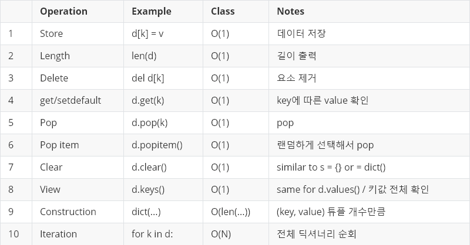

### algorithm **performance analysis**

> **알고리즘 성능 평가**
> 
> - 알고리즘 성능을 평가하기 위해 **복잡도**를 척도로 사용한다.
>     - **시간 복잡도** 
>         - 특정한 크기의 입력에 대하여 알고리즘의 수행 시간 분석
>     - **공간 복잡도** 
>         - 특정한 크기의 입력에 대하여 알고리즘 메모리 사용량 분석

### time complexity

> **시간 복잡도**
> 
> - 특정 알고리즘이 **어떤 문제를 해결하는데 걸리는 시간**이다.
> - **같은 결과를 갖는 코드**도 작성법에 따라 걸리는 시간이 달라지며, 같은 결과를 갖는 코드라면 **시간이 적게 걸리는 것이 좋은 코드**이다.
> - 알고리즘의 로직을 코드로 구현할 때, **시간 복잡도를 고려**한다는 것은 **입력값의 변화와 연산을 실행할 때, 연산 횟수에 비해 시간이 얼마나 걸리는가 ?** 를 의미한다.
> - **효율적인 알고리즘 구현 == 입력값이 커짐에 따라 증가하는 시간의 비율을 최소화한 알고리즘을 구성**한다.
> - **시간 복잡도 표기법**
>     - **Big-O(빅-오) → 상한 점근**
>         - **최악의 경우를 고려**한다. → 프로그램이 실행되는 과정에서 소요되는 최악의 시간까지 고려할 수 있다.
>         - ‘이정도까지 시간이 걸릴 수 있다.’
>         - 최악의 경우를 고려해 대비하는 것이 바람직하기 때문에 가장 많이 사용된다.
>         - **‘입력값의 변화와 연산을 실행할 때, 연산 횟수에 비해 시간이 얼마나 걸리는가 ?’**
>         - **Big-O(빅-오) 표기법의 종류**
>             
>             
>             Big-O complexity chart
>             
>             | N의 크기 | 시간 복잡도  |
>             | --- | --- |
>             | N ≤ 11 | O(N!) |
>             | N ≤ 25 | O(2^N) |
>             | N ≤ 100 | O(N^4) |
>             | N ≤ 500 | O(N^3) |
>             | N ≤ 3000 | O(N^2 log N) |
>             | N ≤ 5000 | O(N^2) |
>             | N ≤ 1000000 | O(N log N) |
>             | N ≤ 10000000 | O(N) |
>             | N ≤ 10000000 이상 | O(log N), O(1) |
>             1. **O(1)**
>                 - **일정한 복잡도**라고 하며, **입력값이 증가하더라도 시간이 늘어나지 않는다.**
>                 - 입력값의 크기와 관계 없이 즉시 출력값을 얻어낼 수 있다.
>                 - **stack의 push, pop**
>                     
>                     
>                     
>                     O(1)
>                     
>                     ```python
>                     def O1 (arr, index):
>                     	return arr[index]
>                     
>                     arr = [1, 2, 3, 4, 5]
>                     index = 1
>                     result = O1(arr, index)
>                     print(result)
>                     ```
>                     
>                     - 입력값의 크기가 커져도 즉시 출력값을 얻을 수 있다.
>                     - arr의 길이가 100만이라도, 즉시 해당 index에 접근에 값을 반환할 수 있다.
>             2. **O(n)**
>                 - **선형 복잡도**라고 하며, **입력값이 증가함에 따라 시간 또한 같은 비율로 증가**한다.
>                 - **이진 트리**
>                     
>                     
>                     
>                     O(n)
>                     
>                     ```python
>                     def On(n):
>                     	for i in n:
>                     		
>                     def On_2(n)
>                     	for i in 2n:
>                     ```
>                     
>                     - On 함수에서는 입력 값 n이 1 증가할 때마다 코드의 실행시간이 1초씩 증가한다.
>                     - 즉 입력값이 증가함에 따라 같은 비율로 걸리는 시간이 늘어난다.
>                     - On_2의 경우 입력값이 1 증가할 때마다 실행시간이 2초씩 늘어난다.
>             3. **O(log n)**
>                 - **로그 복잡도**라고 하며, **Big-O 표기법 중 O(1) 다음으로 빠른 시간 복잡도**를 가진다.
>                 - **BST가 대표적인 O(log n) 알고리즘**이다.
>                     
>                     
>                     
>                     O(log n)
>                     
>             4. **O(n^2)**
>                 - **2차 복잡도**라고 하며, **입력값이 증가함에 따라 시간이 n의 제곱수의 비율로 증가**한다.
>                 - **이중 for문, Selection Sort, Bobble Sort, Insertion Sort**
>                     
>                     
>                     
>                     O(n^2)
>                     
>                     ```python
>                     def On2(n):
>                     	for i in n:
>                     		for j in n:
>                     
>                     def On2_2(n):
>                     	for i in n:
>                     		for j in n:
>                     			for k in n:
>                     ```
>                     
>                     - On2와 On2_2 모두 **O(n2)로 표기**한다.
>             5. **O(2n)**
>                 - **기하급수적 복잡도**라고 하며, **Big-O 표기법 중 가장 느린 시간 복잡도**를 가진다.
>                     
>                     
>                     
>                     O(2n)
>                     
>                     ```python
>                     def fibonacci(n):
>                     	if n <= 1:
>                     		return 1
>                     	return fibonacci(n - 1) + fibonacci(n - 2)
>                     ```
>                     
>                     - **재귀로 구현하는 피보나치 수열**은 대표적인 O(2n) 알고리즘이다.
>     - **Big-Ω(빅-오메가) → 하한 점근**
>         - 최선의 경우를 고려한다. → 어디에서 문제가 발생했는지 알아내기 위해 로직의 많은 부분을 파악해야하므로 오류를 찾는데 상당한 시간이 소요된다.
>     - **Big-θ(빅-세타) → 1, 2의 평균**
>         - 중간, 평균의 경우를 고려한다. → 최선의 경우를 고려한 것과 같은 상황이 생길 수 있다.
> - **시간 복잡도 계산법**
>     - 시간 복잡도를 계산할 때 **조건문, 반복문, 재귀 호출**을 유의하면 된다.
>     - **시간 복잡도에서 상수값은 무시된다.**
>     - 코드를 수행하는 것은 상수 시간으로 간주한다.
>         
>         ```python
>         def func(n):
>         	for i in n:
>         		if n % 0:
>         			continue
>         ```
>         
>         - if문을 보면 짝수 케이스를 무시하고 지나간다.
>         - if문의 코드 실행 시간을 c0, continue의 코드 실행시간을 c1, 나머지 코드 실행 시간을 c2라고 할 때, if문의 실행 시간을 모두 더하면 c0 + c1 + c2가 된다.
>         - c0 + c1 + c2를 for문으로 n번 반복하게 되면 이 코드의 복잡도는 3f(n) = (c0 + c1 + c2) * n이 된다.
>         - 이때 상수는 무시되므로 **O(n)** 이 된다.
>         
>         ```python
>         def func(n):
>         	if n == 0:
>         		return
>         	func(n / 2)
>         ```
>         
>         - func의 함수는 **f(n) = f(1/2n) + c0**이다.
>         - 함수를 풀어서 계산하게 되면 **f(n) = logn**이 된다.
> - **자료형 시간 복잡도**
>     - **list** 
>         
>         
>         
>     - **set** 
>         
>         
>         
>     - **dictionary**
>         
>         
>         
> - **정렬 알고리즘 시간 복잡도**
>     
>     
>     | 정렬 | 최선 | 평균 | 최악 |
>     | --- | --- | --- | --- |
>     | Selection Sort | O(N^2) | O(N^2) | O(N^2) |
>     | Bubble Sort | O(N^2) | O(N^2) | O(N^2) |
>     | Insertion Sort | O(N) | O(N^2) | O(N^2) |
>     | Quick Sort | O(N log N) | O(N log N) | O(N^2) |
>     | Merge Sort | O(N log N) | O(N log N) | O(N log N) |
>     | Heap Sort | O(N log N) | O(N log N) | O(N log N) |
>     | Shell Sort  | O(N log N) | O(N log N) | O(N log N) |

### space complexity

> **공간 복잡도**
> 
> - 작성한 프로그램이 얼마나 많은 공간, 즉 **메모리를 차지하는지 분석하는 방법**이다.
> - **시간과 공간은 반비례적인 경향**이 있다.
> - 최근에는 대용량 시스템이 보편화되면서, 공간 복잡도 보다 **시간 복잡도가 우선순위**가 되었다.
> - 프로그램에 필요한 공간
>     1. **고정 공간**
>     2. **가변 공간**
> - 시간적인 측면을 제외하고 공간 복잡도만 고려했을 때, 고정 공간보다 **가변 공간을 활용하는 자료구조가 더 효율적이다.**