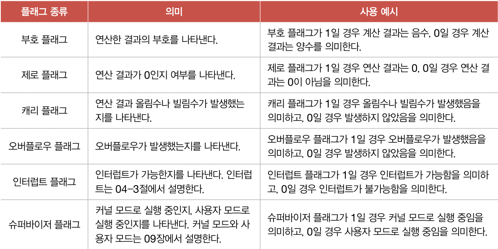

# chapter 4.

 

> ### **CPU의 작동 원리**
> 
> 1. **ALU와 제어장치** 
>			- **ALU**는 레지스터를 통해 피연산자를 받아들이고, 제어장치로부터 수행할 연산을 알려주는 제어신호를 받아들인다. 
>     - CPU가 메모리에 접근하는 속도 VS CPU가 레지스터에 접근하는 속도 → 레지스터가 훨씬 빠르다. 
> 		- 따라서 ALU가 연산할 때마다 결과를 메모리에 저장하게 된다면 당연히 CPU는 메모리에 자주 접근하게 되고, CPU가 프로그램 실행속도를 늦추는 원인이 된다.
> 		- 그렇기 때문에 ALU의 결과값을 메모리가 아닌 레지스터에 우선 저장하는 것이다.
>     - ALU는 계산과 더불어 **플래그**를 내보낸다. 
> 		- 연산 결과에 대한 추가적인 상태 정보를 플래그라고 한다. 
> 		- 플래그들은 플래그 레지스터라는 레지스터에 저장된다. 
> 		- 연산 결과가 연산 결과를 담을 레지스터보다 큰 상황을 오버플러우라고 한다.  
> 		  
>     - **제어장치**는 제어신호를 내보내고, 명령어를 해석하는 부품이다. 
>     - 제어신호는 컴퓨터 부품들을 관리하고 작동시키기 위한 일종의 전기 신호이다. 
> 		    - **제어장치가 받아들이는 정보**
> 		    1. 제어장치는 클럭 신호를 받아들인다. (클럭이란 컴퓨터 부품의 시간단위이다.)
> 		    2. 제어장치는 해석해야 할 명령어를 받아들인다. (CPU가 해석해야 할 명령어는 명령어 레지스터라는 특별한 레지스터에 저장된다.)
> 		    3. 제어장치는 플래그 레지스터 속 플래그 값을 받아들인다. (받아들인 플래그 값을 참고하여 제어신호를 발생시킨다.)
> 		    4. 제어장치는 시스템 버스, 그중에서 제어버스로 전달된 신호를 받아들인다. 
> 2. **레지스터**
>     - **반드시 알아야 할 레지스터**
>         1. **프로그램 카운터 (PC) / 명령어 포인터 (IP)**
>             - 메모리에서 가져올 명령어의 주소, 즉 메모리에서 읽어 들일 명령어의 주소를 저장한다.
> 						- CPU가 메모리 속 프로그램을 순사척으로 읽어들이고 실행해 나갈 수 있는 이유는 CPU 속 프로그램 카운터가 꾸준히 증가하기 때문이다.
>         2. **명령어 레지스터 (IR)**
>             - 해석할 명령어, 방금 메모리에서 읽어 들인 명령어를 저장하는 레지스터이다
> 						- 제어장치는 명령어 레지스터 속 명령어를 받아들이고 해석 후 제어신호를 내보낸다. 
>         3. **메모리 주소 레지스터 (MAR)**
>             - 메모리의 주소를 저장하는 레지스터, CPU가 읽어들이고자 하는 주소 값을 버스로 보낼 때 메모리 주소 레지스터를 거치게 된다.
>         4. **메모리 버퍼 레지스터 (MBR) / 메모리 데이터 레지스터 (MDR)**
>             - 메모리와 주고받을 값(데이터와 명령어)을 저장하는 레지스터, 메모리에 쓰고싶은 값이나 메모리로부터 전달 받은 값을 메모리 버퍼 레지스터를 거친다. 
>                 CPU가 주소 버스로 내보낼 값이 메모리 주소 레지스터를 거치면 데이터 버스로 주소 받을 값은 메모리 버퍼 레지스터를 거친다.    
>         5. **플래그 레지스터 (FR)**
>             - 연산 결과 또는 CPU 상태에 대한 부가적인 정보를 저장하는 레지스터이다.
>         6. **범용 레지스터 (GPR)**
>             - 일반적인 상황에서 자유롭게 사용이 가능한 레지스터, **데이터와 주소 모두 저장할 수 있다.**
>         7. **스택 포인터**
>         8. **베이스 레지스터**
>             - 주소 지정에 사용될 수 있는 특별한 레지스터이다.
>     - **특정 레지스터를 이용한 주소 지정방식 (1) : 스택 주소 지정 방식**
>         - 스택과 스택 포인터를 이용한 주소 지정방식이다.
>					- 스택은 메모리 안에 있고, 메모리 안에는 스택 영역이라는 사용할 영역이 정해져있다.
>					- 이 영역은 다른 주소 공간과는 다르게 스택처럼 사용하기로 암묵적으로 약속된 영역이다.
>					- 스택 포인터는 스택의 꼭대기를 가리키는 레지스터이다.
>     - **특정 레지스터를 이용한 주소 지정방식 (2) : 변위 주소 지정 방식**
>         - 오퍼랜드 필드의 값(변위)과 특정 레지스터의 값을 더하여 유효 주소를 얻어내는 주소 지정 방식이다.
>         - 변위 지정 방식을 사용하는 명령는 연산 코드 필드, 레지스터 필드, 오퍼랜드 필드가 있다.
>         - 변위 주소 지정 방식은 오퍼랜드 필드의 주소와 어떤 레지스터를 더하는지에 따라 장대 주소 지정방식, 베이스 레지스터 주소 지정 방식 등으로 나뉜다.
>             1. **상대 주소 지정 방식** 
>                 - 오퍼랜드와 프로그램 카운터의 값을 더하여 유효 주소를 얻는 방식이다.
>									- 프로그래밍 언어의 if문과 유사하게 모든 코드를 실행하는 것이 아닌, 분기하여 특정 주소의 코드를 실행할 때 사용한다.
>             2. **베이스 레지스터 주소 지정 방식**
>                 - 오퍼랜드와 베이스 레지스터의 값을 더하여 유효주소를 얻는 방식이다.
> 3. **명령어 사이클과 인터럽트**
>     - **명령어 사이클**
>     - **인터럽트**